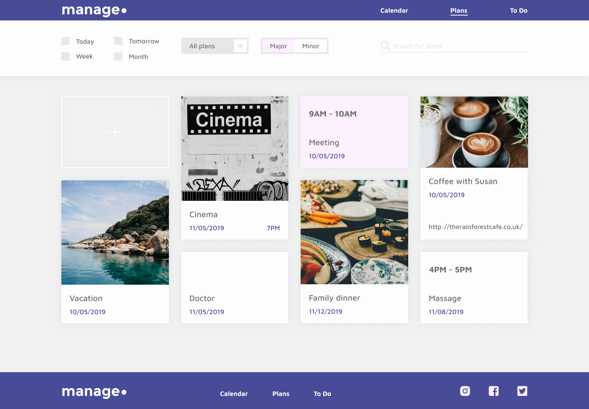

# Manage

## 🚀 Project Description
Manage is a lightweight, responsive single-page task planner. It lets you:
- Filter tasks by date (Today, Tomorrow, Week, Month)  
- Choose task categories (Family, Work, Study, Wish)  
- Set urgency levels (Major, Minor)  
- View and interact with dynamic cards  

Built as a showcase of modern frontend tooling and best practices, Manage demonstrates modular SCSS, Handlebars templating, and a Webpack-powered build pipeline.

---

## 🛠️ Technologies Used
- **Webpack** (4.x) for bundling JS, CSS and assets  
- **Babel** for ES6+ transpilation  
- **SCSS** for structured, maintainable styles  
- **PostCSS** (Autoprefixer) for cross-browser support  
- **Custom Design Tokens**  
  - Color palette variables  
  - Font sizing and weight scales  
  - Font family definitions via `@font-face` 
- **Responsive Breakpoints**  
- **CSS Layout Techniques**  
  - **Flexbox** and **CSS Grid** for component and form layouts  
  - **Multi-column layout** for card grid (`columns` property) 
- **Handlebars** for HTML templating  
- **Yarn** as package manager  
- **Font Awesome** for icons  
- **HTML5** semantic markup and accessibility best practices  

---

## 📸 Screenshot

---

## 🚀 Quick Start
To install `node_modules` run `yarn install`.
To run project in dev mode run `yarn run start-dev-server`.
To create production build run `yarn run build-website`.
Link to the website `http://localhost:8080/homepage.html`.
